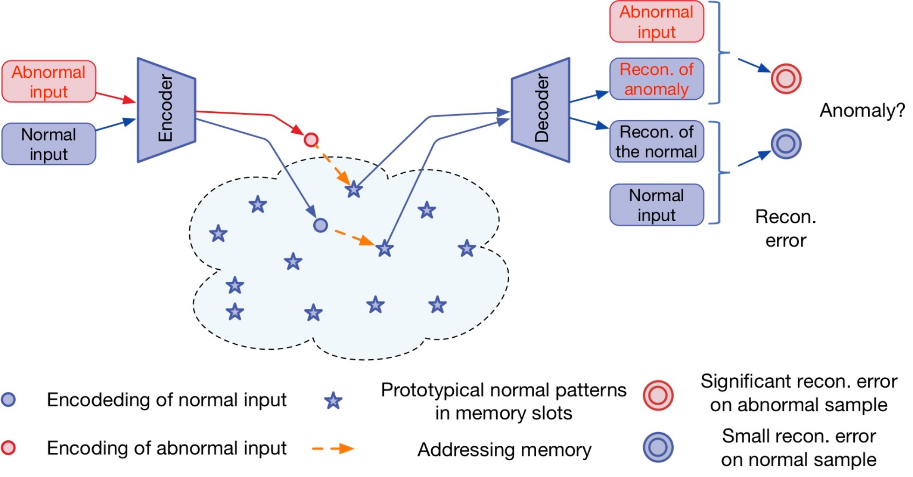

# MemAE
 Memorizing Normality to Detect Anomaly: Memory-augmented Deep Autoencoder for Unsupervised Anomaly Detection
- Conduct experiments as described in the paper using the MNIST dataset.
- To experiment with other datasets, please modify the 'dataset.py' file.
- [Memorizing Normality to Detect Anomaly: Memory-augmented Deep Autoencoder for Unsupervised Anomaly Detection(ICCV 2019)](https://arxiv.org/pdf/1904.02639.pdf)  
  

## Requirements
* Pytorch >= 2.0.0  
* Pytorch-lightning  
  
## Files  
```bash
MemAE  
│  
├── models/              # MemAE models
│   ├── __init__.py      # Main script  
│   ├── memae.py         # preprocessing datasets  
│   └── memory_module.py # evaluation function  
│
├── dataset.py           # MNIST Dataset
├── entropyloss.py       # memory addressing weight loss
├── trainvalid.py        # predict function for submission  
├── utils.py             # util functions
├── visualizer.py        # visualize image, score, memory items
└── main.py              # run for following parser you select
```
### For Run
```bash
python main.py
```
or giving options (options in main.py)  
```bash
python main.py --normal_class 1 --num_epoch 30
```
